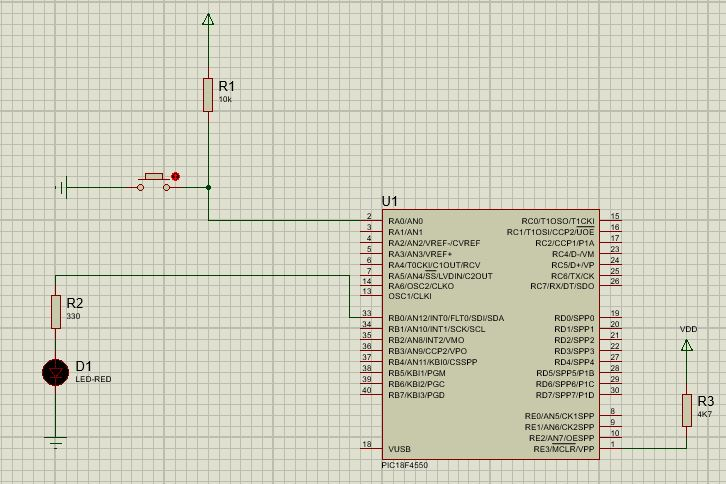

##HARDWARE
<code>
; DEFINITIONS
#include p18f4550.inc ; Include register definition file
 config PLLDIV = 1
 config CPUDIV = OSC1_PLL2
 config USBDIV = 2
 config FOSC = INTOSC_HS ; Oscil·lador intern
 
; VARIABLES

; RESET and INTERRUPT VECTORS

 ; Reset Vector
RST code 0x0
 goto Start
 
; CODE SEGMENT
Start
 MOVLW 0x0F
 MOVWF ADCON1,0 ;I/O digitals
 MOVLW 0xFF
 MOVWF TRISA,0 ;PORTA IN
 MOVLW 0x00
 MOVWF TRISB,0 ;PORTB OUT
 MOVWF TRISC,0 ;PORTC OUT
mentre
 CLRF PORTC,0 ;PORTC = 0x00
 MOVF PORTA,0,0 ;W<--PORTA
 MOVWF PORTB,0 ;PORTB<--W
 SETF PORTC,0 ;PORTC = 0xFF
 GOTO mentre
Loop
 goto Loop
 END
</code>

##SOFTWARE
<code>
; DEFINITIONS
#include p18f4550.inc ; Include register definition file
 config PLLDIV = 1
 config CPUDIV = OSC1_PLL2
 config USBDIV = 2
 config FOSC = INTOSC_HS ; Oscil·lador intern
 
; VARIABLES

; RESET and INTERRUPT VECTORS
 ; Reset Vector
RST code 0x0
 goto Start
 
; CODE SEGMENT
Start
 MOVLW 0x0F
 MOVWF ADCON1,0 ;I/O digitals
 MOVLW 0xFF
 MOVWF TRISA,0 ;PORTA IN
 MOVLW 0x00
 MOVWF TRISB,0 ;PORTB OUT
 MOVWF TRISC,0 ;PORTC OUT
mentre
 CLRF PORTC,0 ;PORTC = 0x00
 COMF PORTA,0,0 ;W<--PORTA
 MOVWF PORTB,0 ;PORTB<--W
 SETF PORTC,0 ;PORTC = 0xFF
 GOTO mentre
Loop
 goto Loop
 END
</code>

